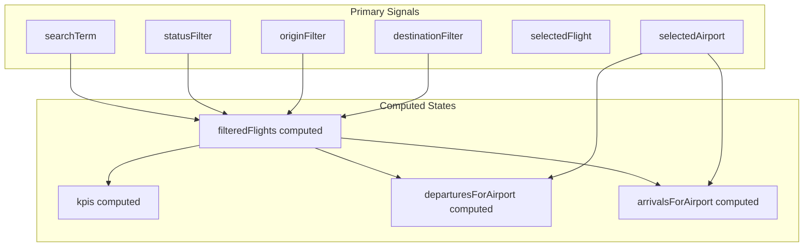

# SkyOps Flight Tracking & Airspace Control - Design Explanation

This document provides a detailed breakdown of the technical design, architectural decisions, state management patterns, and geospatial configurations implemented in the SkyOps Flight Tracking application.

---

## 1. System Architecture & Modular Blueprint

The project follows a clean component-driven architecture based on the **Single Responsibility Principle**. By decoupling the layout, mapping layer, shared state service, and pure visual sub-components, we ensure high maintainability and testability.

```
src/
├── app/
│   ├── core/                  # Core singletons, shared state, structures
│   │   ├── constants/         # Mock data for flights and airport coordinates
│   │   ├── models/            # TypeScript interfaces (Flight, Airport, Weather)
│   │   └── services/          # FlightService (Centralized state engine)
│   ├── components/            # Visual layout components
│   │   ├── map/               # Leaflet map container, drawing flight paths & markers
│   │   └── sidebar/           # Dashboard sidebar housing lists, filters, and overlays
│   │       ├── airport-detail-card/
│   │       ├── flight-detail-card/
│   │       ├── flight-list-item/
│   │       ├── kpi-card/
│   │       └── sidebar.component.html
│   └── shared/                # Universally shared code
│       ├── components/        # status-badge, toggle-switch atoms
│       └── utils/             # Geolocation & mathematical calculation helper files
```

---

## 2. Reactive State Management (Angular Signals)

Reactivity in the application is driven entirely by **Angular Signals** (introduced in Angular 16/17 and updated in Angular 21). This removes the need for manual change detection triggering (`ChangeDetectorRef.detectChanges()`) and avoids the complexity of manual RxJS subscription handling.



### Central State Engine (`FlightService`)
The service stores core UI state variables as read/write signals:
* **UI Controls**: `searchTerm`, `statusFilter`, `originFilter`, `destinationFilter`, `showFilterPanel`, `showTrafficPanel`, `showCloudPanel`.
* **Selection State**: `selectedFlight` (active flight profile), `selectedAirport` (active airport profile).
* **Overlay Overrides**: `showCloudOverlay`, `showRainOverlay`, `showSunOverlay`, `isDarkMode`.
* **Simulation Playback**: `isAnimating`, `animationProgress` (0-100%), `animationSpeed` (1x, 5x, 10x, 20x).

### Computed Derived States
By utilizing Angular's `computed()` primitive, dependent states are evaluated lazily and cached automatically:
- **`filteredFlights`**: Automatically updates whenever `searchTerm`, `statusFilter`, `originFilter`, or `destinationFilter` changes.
- **`kpis`**: Dynamically aggregates counts of active, delayed, and arrived flights directly from `filteredFlights`.
- **`departuresForAirport` & `arrivalsForAirport`**: Dynamically resolves schedules for the currently selected airport.

---

## 3. Geospatial Leaflet Map & Simulation Engine

The application manages complex geospatial plotting, dynamic markers, and playback simulations through **Leaflet**:

### A. Base Tiles & Dark Mode Support
The map dynamically subscribes to `isDarkMode` state changes to switch base tiles on the fly:
* **Dark Mode**: CartoDB Dark Matter tiles (`https://{s}.basemaps.cartocdn.com/dark_all/{z}/{x}/{y}{r}.png`).
* **Light Mode**: CartoDB Positron tiles (`https://{s}.basemaps.cartocdn.com/light_all/{z}/{x}/{y}{r}.png`).

### B. Route Rendering & Trigonometric Bearings
When a flight is selected, a poly-line flight path vector is plotted. The airplane marker's rotation is dynamically calculated using the spherical trigonometric bearing between origin and destination coordinates:

$$\theta = \operatorname{atan2}(\sin(\Delta\lambda)\cos(\phi_2), \cos(\phi_1)\sin(\phi_2) - \sin(\phi_1)\cos(\phi_2)\cos(\Delta\lambda))$$

Where:
* $\phi_1, \phi_2$ represent the latitudes of origin and destination in radians.
* $\Delta\lambda$ represents the difference in longitudes in radians.

This bearing is applied directly to the marker's HTML wrapper using the CSS property:
```css
transform: rotate(N deg);
```

### C. Live Simulation Playback
When simulation playback is active, an animation loop leveraging `requestAnimationFrame` continuously increments the flight's position:
1. It updates a normalized `animationProgress` percentage (0-100%).
2. It interpolates between coordinates using linear interpolation (lerp).
3. The coordinate and heading signals update, reactively translating the aircraft's marker across the map in real-time.

---

## 4. UI/UX Aesthetics & Responsive Styling

The layout is built with **Tailwind CSS v4** to resemble a premium dark-themed Air Traffic Control (ATC) room.

* **Color System**: Custom-tailored dark values (`bg-charcoal`, `bg-obsidian`) paired with high-visibility color-coded operational tags (`text-emerald` for active flights, `text-crimson` for delays, and `text-cyan` for completed arrivals).
* **Glassmorphic Overlays**: Dropdowns, detail cards, and panels feature backdrop filters (`backdrop-blur`) to layer content cleanly over the geospatial map backdrop.
* **Layout Boundaries**: Overlay drawers use `absolute inset-0` inside fixed-width sidebar columns. This explicitly constrains the content height, enabling inner `.overflow-y-auto` panels to scroll smoothly without breaking the page height or layout wrappers.

---

## 5. Testing & Verification Strategy

The repository utilizes **Vitest** for unit testing. Testing practices are split into three layers:

1. **Service Tests**: Directly testing `FlightService` to assert reactive filtering logic, state updates, simulation cycles, and coordinate interpolation mathematics.
2. **Component TestBed Tests**: Bootstrapping Angular components in JSDOM, mapping input/output parameters, and asserting template elements.
3. **DOM Event Simulation**: Simulating actions like tab selections, playback speed changes, range slider inputs, and search queries to verify structural DOM behaviors.
